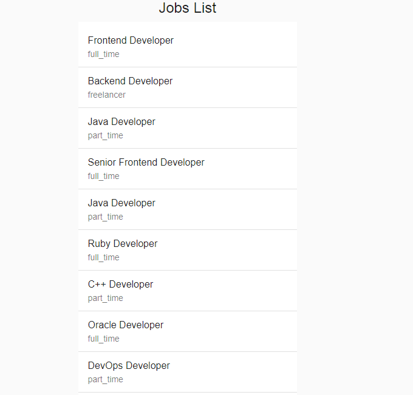

# Jobs List (React, Redux)

## Summary

This is the application developed on React and Redux to 

- To display the list of available jobs
- When clicking on job, user is presented with job details page
- This app is responsive, it will work on any device.

Below libraries and tools have been used to develop this application.

- React for component developed.
- Redux for application state management.
- React Router for routing.
- Material-UI for styles.
- Jest for unit testing.

##### Custome Middleware
Created the custome middleware to handle the all API requests in the application with common action, instead of creating different API calls in action creators.
 
- This will allow us to handle loading spinner/loader globally across the application when handling with diffrent API calls.
- Action creators can be easily tested as all async calls will be handled in custom middleware.
- Code in the action creator is clean and uniform.
- When application is becoming bigger, we can handle all API calls across the application easily with clean code.

### Sample screens




### Get it running
Below are the steps to get it running.

 - Install all the dependences in the application by using the command ``` npm install ```
 - Express server is used to fetch the data from server, hence start the server in seperate terminal by using command `` npm run start:server ``
 - Then start the application in another terminal by using command ``` npm start ```
 - Run the tests using command ``` npm test ```
